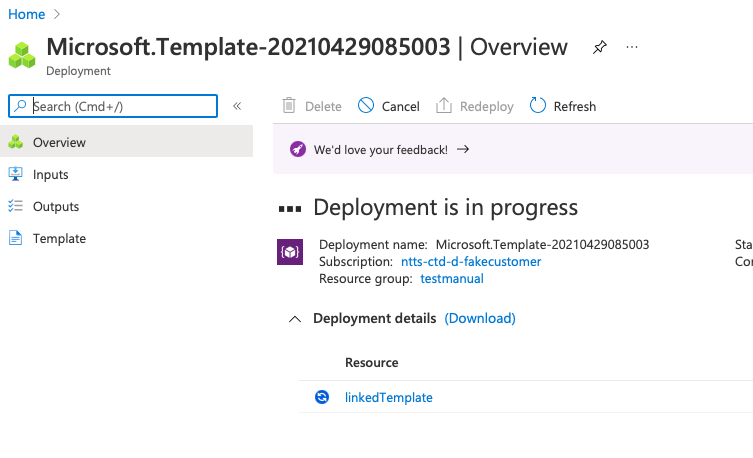
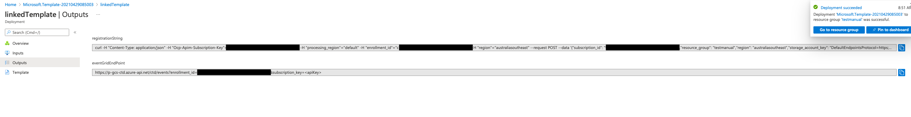
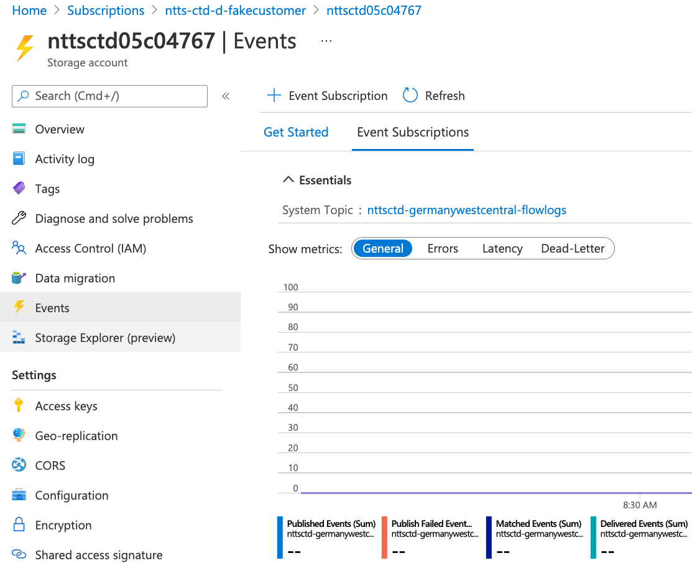
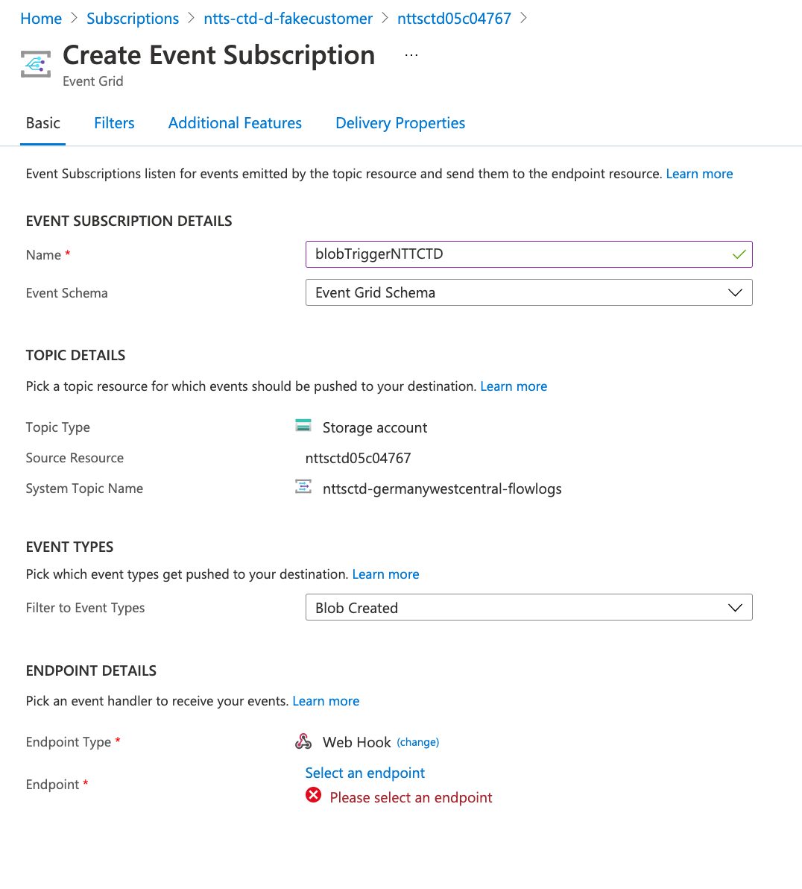

NTT Threat Detection Service

Requirements:

    Your subscription must be registered to "microsoft.insights" in order to enable NSG Flow Logs. 

Deploy Event Hub

Manual Process 

Deploy the template into the Azure Subscription and click on the linkedTemplate URL

The Linked Template will have the output commands needed to manually register the client to the CTD Platform.

The 'registrationString' curl command will register the client to the backend and return a api key to use in the EventGrid WebHook

  {
    "event_grid_api_key": "XXXXXXXXXXXX"
  }

In the Storage Account, Click Events and the "+ Event Subscription"

Event Subscription Details add the following information. 
Name: Static Unique Name
Filter to Event Types: Blob Create
EndPoint Type: Web Hook

Click on "Select and endpoint" and enter eventGridEndPoint string from the template output, with the API key 
that you received from the manual registration command. 

and click "Confirm Selection", then Create

